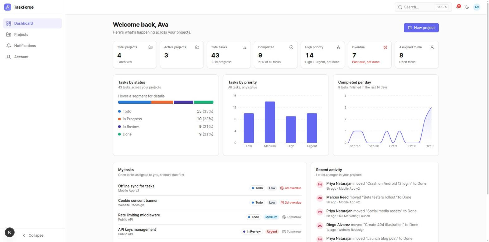
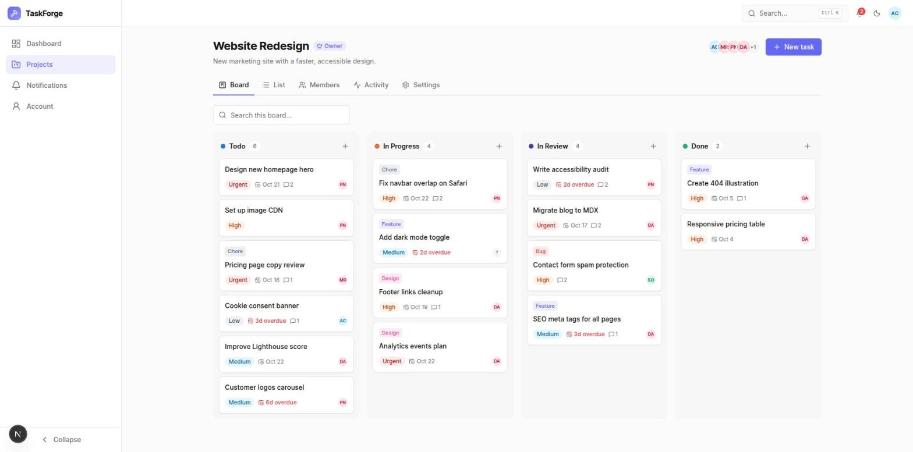

# TaskForge

Project and task management for small teams: projects, a kanban board, a filterable task list, members with roles, comments, notifications and a dashboard. Built with Next.js 15, React 19, TypeScript, TanStack Query and Tailwind.




> **Presenting this project?** Read the [Project Guide](docs/PROJECT_GUIDE.md): architecture, roles and permissions, demo script and likely questions.

## Features

- **Auth**: sign up, sign in, silent session refresh (access token in memory, refresh token in an httpOnly cookie), protected pages, demo accounts.
- **Dashboard**: headline stats, tasks by status (color-blind safe) and priority, 14-day completion trend, my tasks, recent activity.
- **Projects**: search, status filter, grid/list views, pagination, create, edit, archive/restore, delete with typed confirmation.
- **Board**: drag and drop between columns with mouse, touch or keyboard; optimistic updates with rollback; quick add per column.
- **List**: debounced search, multi-select filters (status, priority, assignee, overdue), sort, pagination. All state lives in the URL, so views are shareable.
- **Task drawer**: edit every field, delete, comments (add, edit own, delete), unsaved-changes guard, read-only view for people without rights.
- **Members**: add people by search, owner/admin/member roles, change role, remove, leave, transfer ownership.
- **Notifications**: bell with unread badge, full page, mark read / mark all read.
- **Real-time**: changes by teammates (task moves, edits, comments, members) appear instantly over socket.io, with live notification toasts, a Live/Offline indicator, and automatic reconnect.
- **Account**: profile name, change password, light/dark/system theme.
- **Productivity**: Ctrl/Cmd+K command palette and shortcuts (`c`, `/`, `g d`, `g p`, `g n`, `?`).
- **Polish**: responsive from 360 px up, dark mode, loading skeletons generated from the real UI (boneyard-js), friendly empty, error and 404 states.

## Quick start

```bash
npm install
cp .env.example .env.local     # NEXT_PUBLIC_API_URL=/api/mock (demo mode)
npm run dev                    # http://localhost:3000
npm run socket                 # optional: live updates on :4001 (second terminal)
```

No backend is needed: the app ships with a **demo API** inside Next.js (`/api/mock`) with seeded data.

### Demo accounts

All demo users have the password `Demo1234!`. The login page has one-click buttons for them.

| Email | Role in "Website Redesign" |
|---|---|
| owner@demo.dev | Owner |
| admin@demo.dev | Admin |
| member@demo.dev | Member |

Demo data lives in memory, so restarting the dev server resets it.

### Real-time updates

`npm run socket` starts a small socket.io server (`scripts/socket-server.mjs`). It checks each browser's token against the API, then puts the socket in a room for each of the user's projects plus one for the user. After every change, the demo API posts the event to the server, and the server forwards it to the right room. In the browser, `src/app/(app)/realtime-container.tsx` refreshes the affected React Query caches. It also shows notification toasts, and moves people off a project they were removed from. Without the socket server the app works the same, just without live updates. To try it, open two browsers (or a private window) with different demo accounts.

## Switching to the real backend

Set one variable in `.env.local`:

```bash
NEXT_PUBLIC_API_URL=http://localhost:4000/api/v1
```

Nothing else changes. The demo API (`src/mocks/`) is the contract the backend should follow:

- **Resources** return `{ data, meta? }`. Lists include `meta: { page, limit, total, totalPages, hasNext, hasPrev }`.
- **Errors** return `{ statusCode, error, message, code, details: [{ field, message }] }`. Field details show up next to the matching form inputs.
- **Auth endpoints** follow `src/auth/jwt/config.ts`. `login` and `register` return `{ user, accessToken }` and set the refresh cookie. `refresh` returns `{ accessToken }`. `me` returns the user. These are not wrapped in `data`.
- **Permissions**: 404 for projects you are not a member of, and 403 for actions your role can't do. The full rule set is in `src/lib/permissions.ts`, and the UI and the demo API share it.
- Every endpoint is listed in `src/mocks/routes/*.ts`.
- **Real-time**: the backend's socket.io gateway authenticates with `auth.token` (the access token) and emits the events in `src/types/realtime.ts` to `project:<id>` and `user:<id>` rooms, with the payload `{ projectId, taskId?, userId?, actorId, actorName, message? }`. Point `NEXT_PUBLIC_SOCKET_URL` at it.

## Project structure

```
src/
├─ app/                     routes: page.tsx → *-container.tsx (+ service.ts for API calls)
│  ├─ (auth)/               login, register, forgot/reset password
│  ├─ (app)/                signed-in shell (sidebar, top bar, palette)
│  │  ├─ dashboard/  projects/[projectId]/{board,list,members,activity,settings}/
│  │  └─ notifications/  account/
│  └─ api/mock/[...path]/   demo API entry (forwards to src/mocks)
├─ components/
│  ├─ ui/                   raw shadcn primitives (never edited)
│  ├─ ui/custom/            customized copies of primitives
│  ├─ common/               shared, domain-free (EmptyState, ConfirmDialog, fields, schemas)
│  ├─ layouts/              sidebar, top bar, mobile nav
│  └─ features/             UI per domain (tasks, projects, members, dashboard, ...)
├─ hooks/api-hooks/         useFetchData / useApiMutation (the only way to call the API)
├─ mocks/                   demo API: seed JSON, in-memory db, routes, fixtures
├─ bones/                   generated skeletons (npm run bones)
├─ lib/                     permissions, http client helpers, date utils
├─ types/                   one file per domain (task.ts, project.ts, ...)
└─ store/zustand/           tiny UI state (command palette)
```

Conventions (full version in `guide.md`):

- `page.tsx` only renders a container. Containers hold state. Components get props and callbacks.
- API calls live only in a route's `service.ts`, built on `@/hooks/api-hooks`. Calls used by several pages go in the nearest shared parent's `service.ts`.
- The folder names the role and the file names the thing (`types/task.ts`, not `task.type.ts`). Everything is kebab-case.
- Server state lives in TanStack Query, list filters in the URL, and small UI state in Zustand.

## Scripts

| Script | What it does |
|---|---|
| `npm run dev` | Dev server on :3000 |
| `npm run socket` | Demo real-time server on :4001 |
| `npm run build` / `start` | Production build / serve |
| `npm run lint` / `typecheck` | ESLint / TypeScript |
| `npm test` | Unit tests (Vitest, `tests/unit/`) |
| `npm run bones` | Re-capture loading skeletons (dev server must be running) |
| `npm run theme:preset -- <name>` | Switch the color preset |

## Decisions and trade-offs

- **Demo API as Next.js route handlers** instead of MSW: it's plain HTTP, so httpOnly cookies, refresh and middleware-free auth all behave like the real thing, and switching backends is one env var.
- **Client-side route guard** (`RequireAuth`) instead of `middleware.ts`: the refresh cookie belongs to the API's domain, so Next.js middleware can't see it once the backend runs elsewhere.
- **Server-side sorting and pagination** with the plain `ui/table` instead of TanStack Table, because the API already sorts and pages.
- **Optimistic board moves** with fractional positions (`afterId`), rolled back if the server refuses.
- **Charts are lazy-loaded**, which keeps Recharts (~100 kB) out of the dashboard's first load.

## Not included yet

- File attachments, bulk task actions, i18n, offline mode
- Playwright end-to-end tests
